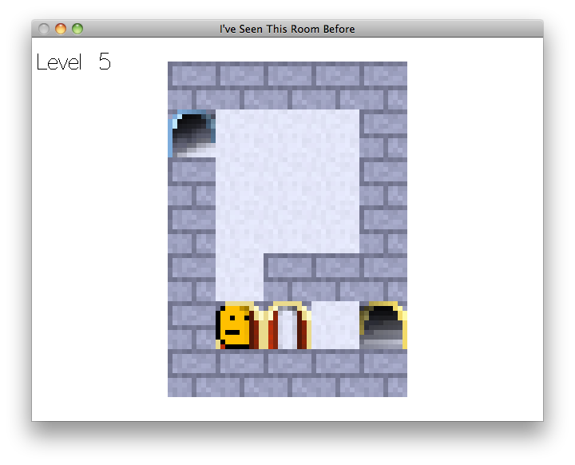

# I've Seen This Room Before

This is my contribution for [Ludum Dare edition #31](http://ludumdare.com/compo/2014/12/03/welcome-to-ludum-dare-31/), a competition where you have to program and draw art (and make music, but I didn't bother) for a game in only 48 hours. This was my first Ludum Dare. It was quite a challenge!

## Story

You are in a room. The only room in the game. There are stairways going up and down, but somehow they lead back to this same room. The architect must have been a fan of Escher paintings.

As you walk up and down the stairs, you start to notice strange details. Was this wall here before? How come I've never noticed this shiny golden key, lying there on the floor, begging to be picked up?

It's a mystery. I suggest you continue going up. Or down; they both lead to the same room anyway.

## FAQ

1.  The first few rooms are boring as hell. What's this game about?
    
    Keep going. You'll see.
1.  This seems impossible. Is it possible to complete this game?
    
    Yes. Keep exporing! This is a game where the challenge is to figure out the mechanics. There are no hidden passages or anything like that, everything you need to know is in plain sight, you just don't understand it yet.
